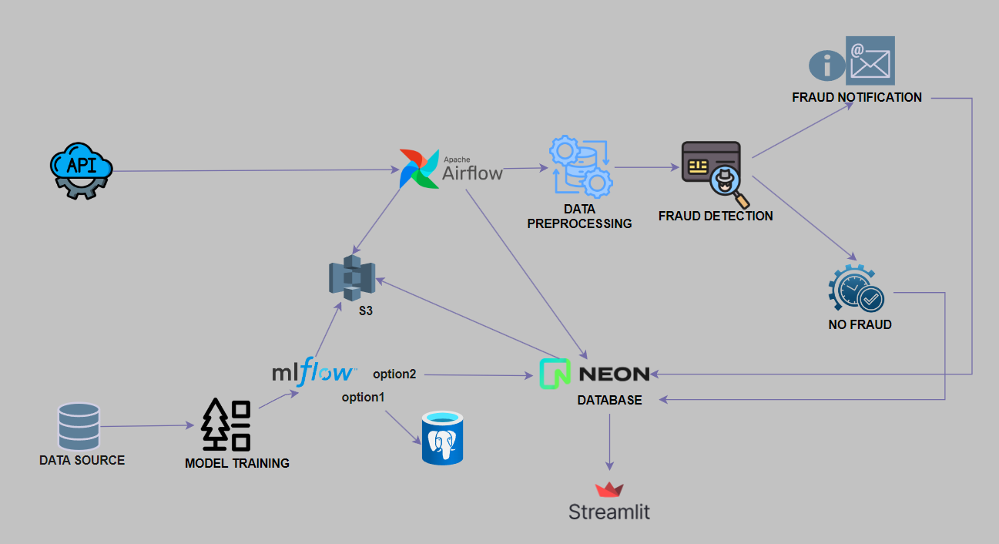

# FraudDetection 🛡️ - Real-Time Payment Protection System

## 📋 Overview
FraudDetection is an end-to-end fraud detection system that processes payment transactions in real-time and provides immediate alerts for suspicious activities. Built with modern data engineering practices, it combines machine learning, real-time processing, and automated monitoring to protect financial transactions.

## ⚠️ Important Security Notice
**CRITICAL**: This project contains sensitive configuration files that must be handled with care:

- Both `.env` and `.secrets` files MUST be added to `.gitignore`
- Never commit these files to version control
- Use the provided `.env.example` and `.secrets.example` as templates

## 🏗️ Technical Architecture and options



This project can be deployed in two configurations:

### Services
- **Apache Airflow**: Workflow orchestration
  - Transaction processing DAG (every minute)
  - Backup DAG (monthly)
  - Monitoring DAG (daily)

- **MLflow**: ML model management
  - Model versioning
  - Experiment tracking
  - Model artifacts storage
  - Available in two configurations:
    1. Local PostgreSQL (default)
    2. NeonDB (cloud option)
  
- **Streamlit**: Data visualization
  - Real-time dashboard
  - Interactive data exploration
  - Performance metrics

### Infrastructure option
1. Local PostgreSQL (Default)
- MLflow metadata stored in local PostgreSQL container
- Simpler setup for development and testing
- No external database dependencies
- Ideal for local development and testing

2. NeonDB Configuration
- MLflow metadata stored in NeonDB (cloud PostgreSQL)
- Better for production environments
- Enables team collaboration
- Requires NeonDB account and configuration

## 🎯 Key Features
- **Real-time Transaction Processing** 🔄
  - Minute-by-minute transaction monitoring
  - Immediate fraud detection using Random Forest model
  - Instant email notifications for suspicious transactions

- **Automated Data Pipeline** 🔁
  - ETL process for transaction data
  - SMOTE handling for imbalanced datasets
  - Automated model deployment

- **Comprehensive Monitoring** 📊
  - System health checks
  - API status monitoring
  - Database connection verification
  - S3 storage validation

## 🤖 Detection Model

### Overview
- **Type**: Random Forest Classifier
- **Library**: scikit-learn
- **Imbalance Handling**: SMOTE (Synthetic Minority Over-sampling Technique)

### Features Used
- Temporal: hour, day of week, month
- Geographic: customer-merchant distance, location
- Transactional: amount, category, merchant
- Demographic: customer age, job

### Model Configuration
```python
RandomForestClassifier(
    n_estimators=100,      # Number of trees
    max_depth=10,          # Maximum depth
    min_samples_split=5,   # Minimum samples for split
    min_samples_leaf=2,    # Minimum samples per leaf
    class_weight='balanced' # Imbalance handling
)
```

### Performance
- Precision: ~0.95
- Recall: ~0.92
- F1 Score: ~0.93
- AUC-ROC: ~0.96

### Processing Pipeline
1. Missing values imputation
2. Numerical features standardization
3. Categorical features encoding
4. SMOTE application
5. Random Forest training

## 🛠️ Installation Guide

### 1. Prerequisites
```plaintext
Required for all configurations:
- Docker and Docker Compose
- Python 3.9+
- AWS Account & S3 Bucket
- Gmail Account (for SMTP)

Additional for NeonDB configuration:
- Neon Database Account
```

### 2. Environment Setup

#### A. Configure Environment Files
1. Create environment files from templates:
```bash
cp .env.example .env
cp .secrets.example .secrets
```

2. Configure `.secrets` and `.env` according to your chosen infrastructure (uncomment local postgres url or not in env)

### B. Docker Configuration
Configure docker-compose.yml according to your chosen infrastructure option:

#### Option 1: Local PostgreSQL (Default)
- Ensure the local PostgreSQL services are uncommented in docker-compose.yml:
  - `mlflow-postgres` service
  - Default `mlflow` service configuration
- Comment out the Option 2 NeonDB `mlflow` service configuration

#### Option 2: NeonDB
- Comment out the Option 1 services in docker-compose.yml:
  - Comment out `mlflow-postgres` service
  - Comment out default `mlflow` service configuration
- Uncomment the Option 2 NeonDB `mlflow` service configuration

#### C. Configure Email Notifications
1. Enable 2-Step Verification in your Google Account
2. Generate App Password:
   - Go to Google Account Settings
   - Security > App Passwords
   - Select "Mail" and "Other"
   - Copy generated password to `.secrets` EMAIL_PASSWORD
3. Update email recipient in `dags/utils/common.py`

#### D. Configure AWS S3
1. Create S3 Bucket:
```bash
aws s3 mb s3://your-bucket-name
```

2. Create required directories and upload initial files:
```bash
# Upload ETL script and model
aws s3 cp models/etl.py s3://your-bucket-name/fraud_detection_bucket/etl/
aws s3 cp models/random_forest_model.pkl s3://your-bucket-name/fraud_detection_bucket/models/
```

### 3. Database Setup

#### Option 1: Local PostgreSQL (Default)
No additional setup required - tables will be created automatically

#### Option 2: NeonDB Setup
1. Create a Neon account and project
2. Execute the following SQL scripts:

```sql
-- Create fraud_transactions table
CREATE TABLE IF NOT EXISTS fraud_transactions (
    transaction_id SERIAL PRIMARY KEY,
    cc_num BIGINT,
    merchant VARCHAR(255),
    category VARCHAR(100),
    amt DECIMAL(10, 2),
    first VARCHAR(100),
    last VARCHAR(100),
    gender CHAR(1),
    street VARCHAR(255),
    city VARCHAR(100),
    state VARCHAR(50),
    zip INTEGER,
    lat DECIMAL(10, 6),
    long DECIMAL(10, 6),
    city_pop INTEGER,
    job VARCHAR(255),
    dob DATE,
    trans_num VARCHAR(255) UNIQUE,
    merch_lat DECIMAL(10, 6),
    merch_long DECIMAL(10, 6),
    is_fraud BOOLEAN DEFAULT TRUE,
    trans_date_trans_time TIMESTAMP
);

-- Create normal_transactions table (only is_fraud change)
CREATE TABLE IF NOT EXISTS normal_transactions (
    transaction_id SERIAL PRIMARY KEY,
    cc_num BIGINT,
    merchant VARCHAR(255),
    category VARCHAR(100),
    amt DECIMAL(10, 2),
    first VARCHAR(100),
    last VARCHAR(100),
    gender CHAR(1),
    street VARCHAR(255),
    city VARCHAR(100),
    state VARCHAR(50),
    zip INTEGER,
    lat DECIMAL(10, 6),
    long DECIMAL(10, 6),
    city_pop INTEGER,
    job VARCHAR(255),
    dob DATE,
    trans_num VARCHAR(255) UNIQUE,
    merch_lat DECIMAL(10, 6),
    merch_long DECIMAL(10, 6),
    is_fraud BOOLEAN DEFAULT FALSE,
    trans_date_trans_time TIMESTAMP
);

-- Create indices
CREATE INDEX IF NOT EXISTS  idx_normal_trans_date ON normal_transactions(trans_date_trans_time);
CREATE INDEX IF NOT EXISTS idx_fraud_trans_date ON fraud_transactions(trans_date_trans_time);
CREATE INDEX IF NOT EXISTS idx_normal_trans_num ON normal_transactions(trans_num);
CREATE INDEX IF NOT EXISTS idx_fraud_trans_num ON fraud_transactions(trans_num);

-- Create views
CREATE OR REPLACE VIEW recent_transactions AS
[Your view definition]

CREATE OR REPLACE VIEW daily_stats AS
[Your view definition]

for example :
--View of recent transactions (combined fraudulent and normal)
CREATE OR REPLACE VIEW recent_transactions AS
SELECT 
    transaction_id,
    merchant,
    category,
    amt,
    is_fraud,
    trans_date_trans_time,
    city,
    CASE WHEN is_fraud THEN 1 ELSE 0 END as fraud_probability
FROM fraud_transactions
UNION ALL
SELECT 
    transaction_id,
    merchant,
    category,
    amt,
    is_fraud,
    trans_date_trans_time,
    city,
    CASE WHEN is_fraud THEN 1 ELSE 0 END as fraud_probability
FROM normal_transactions
ORDER BY trans_date_trans_time DESC;

-- Daily Statistics View
CREATE OR REPLACE VIEW daily_stats AS
SELECT 
    DATE(trans_date_trans_time) as date,
    COUNT(*) as total_transactions,
    SUM(CASE WHEN is_fraud THEN 1 ELSE 0 END) as fraud_count,
    ROUND((SUM(CASE WHEN is_fraud THEN 1 ELSE 0 END)::decimal / COUNT(*)) * 100, 2) as fraud_rate,
    SUM(amt) as total_amount,
    ROUND(AVG(amt)::numeric, 2) as avg_amount,
    SUM(CASE WHEN is_fraud THEN amt ELSE 0 END) as fraud_amount_total,
    SUM(CASE WHEN NOT is_fraud THEN amt ELSE 0 END) as normal_amount_total
FROM (
    SELECT trans_date_trans_time, is_fraud, amt 
    FROM fraud_transactions
    UNION ALL
    SELECT trans_date_trans_time, is_fraud, amt 
    FROM normal_transactions
) AS all_transactions
GROUP BY DATE(trans_date_trans_time)
ORDER BY date DESC;
```

### 4. Deploy Services

1. Build Docker images:
```bash
docker-compose build
```

2. Start services:
```bash
docker-compose --env-file .env --env-file .secrets up -d
```

3. Verify service status:
```bash
docker-compose ps
```

## 📊 Accessing Services

- Airflow UI: http://localhost:8080
  - Username: admin
  - Password: [from .secrets]

- MLflow UI: http://localhost:5000
  - Username: admin
  - Password: [from .secrets]

- Streamlit Dashboard: http://localhost:8501

## 🔍 Monitoring and Performance

### Airflow DAGs
The project uses 4 main DAGs:

1. **Transaction Processing DAG** (every minute)
   - Processes transactions in real-time
   - Applies fraud detection model
   - Triggers alerts when fraud is detected

2. **Backup DAG** (monthly)
   - Performs complete NEON database backup
   - Stores backups in S3

3. **Monitoring DAG** (daily)
   - Checks API availability
   - Tests database connectivity
   - Validates S3 access
   - Controls model accessibility

4. **Daily Report DAG** (daily at 6:00 AM)
   - Generates previous day's transaction report
   - Sends email containing:
     - Total number of transactions
     - Number of detected frauds
     - Fraud rate
     - Amounts (total, average, max)
     - Amount of normal vs fraudulent transactions
   - Data is also available:
     - On Streamlit dashboard (port 8501)
     - In MLflow interface (port 5000)

### Performance Metrics
The Streamlit dashboard (http://localhost:8501) provides:
- Real-time transaction view
- Daily statistics
- Previous day metrics
- Fraud rate evolution graphs
- Top 10 merchants by fraud rate

## 🛟 Troubleshooting

### Common Issues

1. **Database Connection Issues**
```bash
# For Local PostgreSQL
docker-compose ps mlflow-postgres
docker-compose logs mlflow-postgres

# For NeonDB
psql $NEON_DATABASE_URL
```

2. **S3 Access Issues**
```bash
aws s3 ls s3://your-bucket-name
```

3. **Email Configuration**
- Verify app password is correct
- Check SMTP settings
- Test email connection

4. **Docker Issues**
```bash
docker-compose logs -f
docker-compose restart
```

## 🔐 Security Notes
- Keep `.env` and `.secrets` secure
- Regularly rotate credentials
- Monitor access logs
- Use least privilege principle for AWS IAM
- Monitor MLflow experiment tracking logs

**Technical Constraint**: Due to a current limitation in Docker's environment variable handling, the NeonDB URL must be specified in the `.env` file rather than `.secrets` for MLflow experiment tracking to work properly. While this is a temporary solution, it makes it even more critical to:
1. Never commit the `.env` file
2. Regularly rotate your database credentials
3. Use restricted database users with minimum required permissions
4. Consider this in your security assessment

video : https://www.loom.com/share/26bb3f90d15b413a8dd25342ebdd6768?sid=eda02fc1
5576-41ef-a3ab-e2af3c41651a 

